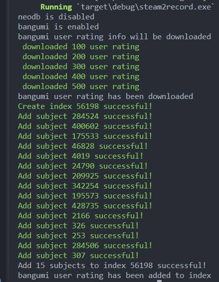

# RANK2COLLECTION

**根据neodb、bangumi的评分记录，自动创建满分目录**

## 说明
- 程序逻辑如下:
    1. 获取评分记录
    2. 新建目录，根据设置的筛选条件，自动添加
- 注意事项
    1. 默认将标记结果设为公开，如介意，请自行修改代码。

## 使用
1. 修改`config.toml.example`为对应的配置，并重名为`config.toml`
2. `neodb_token`可参考[NeoDB 获取 Access Token-大大的小蜗牛](https://eallion.com/neodb_token)获取
3. `bangumi_token`在[个人令牌](https://next.bgm.tv/demo/access-token)获取
4. 运行
- 法一：自行编译，运行
    ```
    # 请确保有相关运行环境
    cargo build
    cargo run 
    ```
- 法二：使用release中已编译好的程序(暂时只支持linux平台),运行截图如下
  

## 踩坑
- 发布过程,例:
    ```bash
    # 修改CHANGELOG.md
    git tag -a v0.3.0 -m "尝试自动化发布release"
    git push origin v0.3.0
    ```


## 参考链接
- [Bangumi API](https://bangumi.github.io/api/#/%E6%94%B6%E8%97%8F/postUserCollection)
- [NeoDB API Developer Console](https://neodb.social/developer/#/default/journal_api_mark_item)